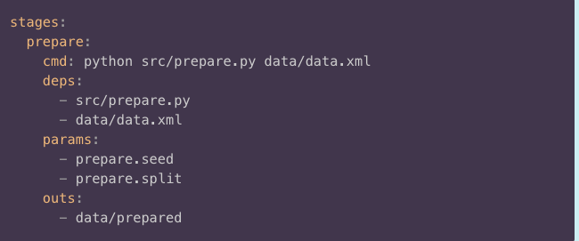

```{r setup, include=FALSE}
knitr::opts_chunk$set(echo = FALSE)
```

# Intorduction

The DVC pipeline is a toolkit for Statistics and data science to capture the mechanism in which you process your workflow. With DVC pipeline, you can maintain a reproducible workflow without repeating yourself. DVC pipeline learns how your pipeline assembles together, skips costly runtime for tasks that are already up to date, runs only the necessary computation, and shows tangible evidence that the results match the underlying code and data. 

From the DVC official documentation:

> DVC pipelines and their data can also be easily versioned (using Git). This allows you to better organize projects, and reproduce your workflow and results later — exactly as they were built originally! For example, you could capture a simple ETL workflow, organize a data science project, or build a detailed machine learning pipeline.


# Sateges

There are tow ways one can generate the pipeline. The main approach is to use the `{dvc run}`. This function allow to form a steps of pipeline that can be tracked with Git. The steps are connected via the input and output of each stage.

## Example code from the DVC documentation


First get the sample code 

```python
wget https://code.dvc.org/get-started/code.zip
unzip code.zip
rm -f code.zip
```

Then install the required packages

```python
pip install -r src/requirements.txt
```

Next we run the `{dvc run}`

```python
dvc run -n prepare \
          -p prepare.seed,prepare.split \
          -d src/prepare.py -d data/data.xml \
          -o data/prepared \
          python src/prepare.py data/data.xml
```

The `{dvc run}` code generate a yml file `{dvc.yaml}`. It contains details from the used command. For instance, for each step the dependency for each step and the output. Below is an example of what the `{dvc.yaml}` could looks like.



# Reproduce

The whole point of creating this dvc.yaml file is the ability to easily reproduce a pipeline:

```python
dvc repro
```


# Exercises

1. Choose a simple machine learning example from your eralier courses.
2. Arrenge the code you wrote in seperate python files for example :get_data.py, prepare.py (here you can do data processing), train.py (for training the model), output.py (you can imagining any kind of report that you want to use)
3. Use Git and Github.
4. Use the above approach to write your porject pipeline use DVC pipeline.
5. Change some of the parameters used in your prooject (try to imrove the result). and use the command `{dvc repro}`.
6. Read the out in the command line form the running the `{dvc repro}`. What did you notice.
7. Do a change in the prepare.py file and repat the question 5 and 6.


