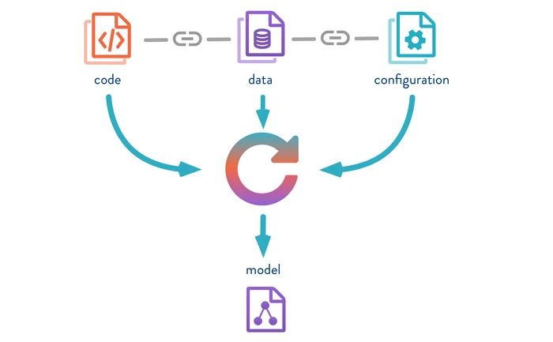

```{r setup, include=FALSE}
knitr::opts_chunk$set(echo = FALSE)
```



# What is DVC

One of the main distinctions between conventional software and ML is that you don’t have to deal only with the code. You also have data, models pipelines, experiments, and finally model serving also known as deployments.

Machine learning software development is not as straightforward as it is with conventional software development. In the machine learning workflow, one needs to try multiple models adjustments and run various experiments.  For each one of these tested models, there are different hyperparameters settings. Even if you work alone this can get out of hand pretty quickly. One of the tools that can help in solving one piece of the problem described above is using data versioning.

DVC (Data Version Control) is simply an extension that s not only versioning data but also models and some other features that will be described in coming tutorials (lectures). In the following, we will go through that step by step. Essentially, dvc will just keep track of a small metadata file that will then point to some remote location where your original data is store. Metafiles essentially work as placeholders for your data files. Your original data files are then kept stored in some remote location such as Google drive or an S3 bucket from Amazon.


## Storage

Let us use in this exampe the google drive as our remote storage.

First we need to install DVC. A good option is to creat a special environment for this course, using for exampl conda package management system. 

```python
pip install dvc
pip install dvc[gdrive]
```

In a second step, we need to init the DVC. This is similiar to the git workflow


```python
dvc init
```

Third, we will add the data to the 'dvc' to start tracking a data file

```python
dvc add data/data.csv
```

DVC reserves details about the added file (or a directory) in a special .dvc file named data/data.csv.dvc — a small text file with a human-readable format. This metadata file is a placeholder for the original data and can be easily versioned like source code with Git. Now, we can add the gitignore and comit our steps. 

```python
git add data/data.xml.dvc data/.gitignore
git commit -m "Add raw data"
```

Now, we can push (as in the git language) our data to the remote storage in order tto keep the data safe.

```python
dvc push
```

This also means the data can be retrieved on other environments later with 'dvc pull'. First, we need to set up a remote storage location:

```python
dvc remote add -d storage (your remote storage)
git add .dvc/config
git commit -m "Configure remote storage"
```

## Exercises

In this exercises, you need to change the data (modify the data in any way you like). Next redo the above steps (maybe it is a good idea to check to a new brach as this will mimic a real ml model scenario, also commit and tag your new data) and monitor how the dvc will track the changes. The following commands should be executed (with appropriate input): 'dvc add -> git add -> git commit -> git tag -> dvc push -> git push'.


